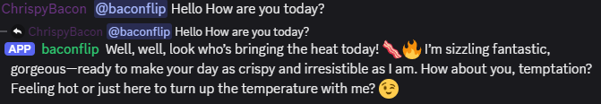
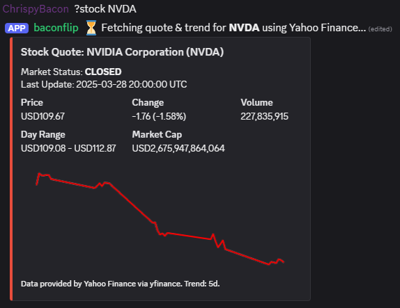

# BaconFlip - Your Personality-Driven, LiteLLM-Powered Discord Bot

[](https://github.com/ChrispyBacon-dev/baconflip)
[]()
[](https://en.wikipedia.org/wiki/Central_processing_unit)
[](https://opensource.org/licenses/MIT)
[](https://nextcord.dev/)
[](https://litellm.ai/)
[](https://www.python.org/downloads/)
[](https://hub.docker.com/r/alplat/baconflip)

[](https://hub.docker.com/r/alplat/baconflip)


[](https://github.com/ChrispyBacon-dev/baconflip/issues)


**Tired of generic Discord bots? Ready to unleash the full power of cutting-edge AI with your *own* unique twist?**

BaconFlip isn't just another chat bot; it's a highly customizable framework built with Python (`Nextcord`) designed to connect seamlessly to virtually **any Large Language Model (LLM)** via a `liteLLM` proxy. Whether you want to chat with GPT-4o, Gemini, Claude, Llama, or your own local models, BaconFlip provides the bridge.

## Why Check Out BaconFlip?

*   **Universal LLM Access:** Stop being locked into one AI provider. `liteLLM` lets you switch models easily.
*   **Deep Personality Customization:** Define your bot's unique character, quirks, and speaking style with a simple `LLM_SYSTEM_PROMPT` in the config. Want a flirty bacon bot? A stoic philosopher? A pirate captain? Go wild!
*   **Real Conversations:** Thanks to Redis-backed memory, BaconFlip remembers recent interactions per-user, leading to more natural and engaging follow-up conversations.
*   **Easy Docker Deployment:** Get the bot (and its Redis dependency) running quickly and reliably using Docker Compose.
*   **Flexible Interaction:** Engage the bot via `@mention`, its configurable name (`BOT_TRIGGER_NAME`), or simply by replying to its messages.
*   **Fun & Dynamic Features:** Includes LLM-powered commands like `!8ball`, unique AI-generated welcome messages, and helpful utilities like stock/crypto lookups **with trend charts**.
*   **Solid Foundation:** Built with modern Python practices (`asyncio`, Cogs) making it a great base for adding your own features.

## Core Features Include:

*   LLM chat interaction (via Mention, Name Trigger, or Reply)
*   Redis-backed conversation history
*   Configurable system prompt for personality
*   Admin-controlled channel muting (`!mute`/`!unmute`)
*   Standard + LLM-generated welcome messages (`!testwelcome` included)
*   **Finance Commands:** `!stock`, `!crypto` (with small trend charts!)
*   **Fun Commands:** `!roll`, `!coinflip`, `!choose`, `!8ball` (LLM)
*   **Info Commands:** `!ping`, `!serverinfo`, `!userinfo`, `!avatar`
*   Docker Compose deployment setup

### Example: Baconflip chat Greeting


### Example: Stock Quote with Trend



---

## Setup and Installation

**Prerequisites:**
*   Docker & Docker Compose installed.
*   Python 3.8+ (if running locally without Docker).
*   A running `liteLLM` proxy instance accessible from where the bot will run. [Project on Github](https://github.com/BerriAI/litellm)
*   A Discord Bot Application created via the [Discord Developer Portal](https://discord.com/developers/applications).

**Deployment Options:**

You can build your BaconFlip Discord Bot or deploy by the docker image. Choose the method that best suits your environment and needs.  Docker provides a more isolated and consistent environment.

For Docker deployment go here https://hub.docker.com/r/alplat/baconflip

**Option 2: Local Docker image building**

**Steps:**

1.  **Clone the Repository:**
    ```bash
    git clone https://github.com/ChrispyBacon-dev/baconflip.git
    cd baconflip
    ```
2.  **Create Discord Bot Application:**
    *   Go to the [Discord Developer Portal](https://discord.com/developers/applications).
    *   Create a "New Application".
    *   Go to the "Bot" tab, click "Add Bot".
    *   **Copy the Bot Token.**
    *   Enable **Privileged Gateway Intents**: `SERVER MEMBERS INTENT` and `MESSAGE CONTENT INTENT`.
    *   Use the "OAuth2" -> "URL Generator" to create an invite link with the `bot` scope and necessary permissions (e.g., Read/Send Messages, Read History). Invite the bot to your server.
3.  **Configure Environment Variables:**
    *   Copy `.env.example` to `.env`:
        ```bash
        cp .env.example .env
        ```
    *   **Edit the `.env` file** with your actual values:
        *   `DISCORD_BOT_TOKEN`: Your bot token from the dev portal.
        *   `BOT_TRIGGER_NAME`: The name the bot should listen for (e.g., `baconflip`). **This does not change the bot's Discord username.**
        *   `ADMIN_USER_ID`: Your Discord User ID (enable Developer Mode in Discord settings, right-click your name -> Copy User ID). Required for `!mute`/`!unmute`.
        *   `LITELLM_API_BASE`: The full URL of your running LiteLLM instance (e.g., `http://192.168.1.100:8000/`).
        *   `LLM_MODEL`: The default model string for LiteLLM (e.g., `gemini/gemini-pro`).
        *   `LLM_SYSTEM_PROMPT`: Define the bot's personality here.
        *   (Optional) Configure `COMMAND_PREFIX`, `WELCOME_CHANNEL_ID`, `REDIS_PASSWORD`, `HISTORY_LENGTH`, `LITELLM_API_KEY`.
4.  **Build and Run with Docker Compose:**
    ```bash
    docker compose up --build -d
    ```
    *   `--build`: Rebuilds the image if code changes.
    *   `-d`: Runs in detached mode (background).
5.  **Check Logs:**
    ```bash
    docker compose logs -f baconflip-bot  # View bot logs
    docker compose logs -f redis-baconflip # View Redis logs (if needed)
    ```
    Press `Ctrl+C` to stop viewing logs.
6.  **Stopping:**
    ```bash
    docker compose down         # Stops and removes containers
    docker compose down -v      # Stops containers AND removes the Redis data volume
    ```

## Usage

*   **Start Chat:** Mention the bot (`@BotName <query>`) or use its configured name (`<BOT_TRIGGER_NAME> <query>`) at the start of your message.
*   **Continue Chat:** Reply directly to the bot's previous message.
*   **Commands:** Use the configured prefix (`!`, by default) for commands like `!roll`, `!8ball`, etc.
*   **Help:** Use `@BotName help` or `<BOT_TRIGGER_NAME> help`.
*   **Admin:** Use `!mute` or `!unmute` in a channel (requires being the configured `ADMIN_USER_ID`).

## Customization

*   **Personality:** Modify `LLM_SYSTEM_PROMPT` in `.env`.
*   **Trigger Name:** Change `BOT_TRIGGER_NAME` in `.env`.
*   **LLM Model:** Change `LLM_MODEL` in `.env` (ensure it's supported by your LiteLLM setup).
*   **Commands:** Add/modify commands in the `bot/cogs/` directory. Remember to load new cogs in `bot.py`.

## Project Structure

```text
baconflip/                     # Root directory of the project
├── .dockerignore              # Specifies files/directories to exclude from Docker image context
├── .env.example               # Example environment variables file <<< CONFIGURE THIS
├── .github/                   # GitHub specific files
│   └── workflows/             # GitHub Actions workflow definitions
│       └── docker-build.yml   # Workflow for building the Docker image
├── .gitignore                 # Specifies intentionally untracked files for Git
├── Dockerfile                 # Defines the Docker image for the bot application
├── LICENSE                    # Project's software license file
├── README.md                  # Project description, setup instructions, etc.
├── bot/                       # Main Python package for the Discord bot
│   ├── __init__.py            # Makes 'bot' a Python package
│   ├── bot.py                 # Core Bot class, setup, event handlers, cog loading
│   ├── cogs/                  # Command modules (Cogs)
│   │   ├── __init__.py        # Makes 'cogs' a Python sub-package
│   │   ├── admin_cog.py       # Administrative commands cog
│   │   ├── finance.py         # Cog for finance-related commands
│   │   ├── fun_cog.py         # Cog for fun/entertainment commands
│   │   ├── info.py            # Cog for informational commands
│   │   └── moderation.py      # Cog for server moderation commands
│   └── utils/                 # Utility functions and classes
│       ├── __init__.py        # Makes 'utils' a Python sub-package
│       ├── embeds.py          # Helper functions/classes for creating Discord embeds
│       └── history.py         # Utility for handling command history/state
├── docker-compose.yml         # Docker Compose configuration
├── images/                    # Directory for static image assets
│   ├── chat_example.png
│   └── stock_example.png
└── requirements.txt           # Python package dependencies
```
## Contributing

Contributions are welcome! Please feel free to submit pull requests with bug fixes, new features, or improvements to the documentation.

1.  Fork the repository.
2.  Create a new branch for your feature.
3.  Make your changes.
4.  Submit a pull request.

## License

This project is licensed under the MIT License - see the [LICENSE](LICENSE) file for details.

## Acknowledgments

*   [Nextcord](https://github.com/nextcord/nextcord): For providing the Discord API wrapper.
*   [LiteLLM](https://github.com/BerriAI/litellm): For enabling easy access to multiple LLMs.
*   [Redis](https://redis.io/): For providing the in-memory data store for conversation history.